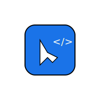

# 🎯 Cursor 最佳实践指南

<div align="center">



**🚀 专业的Cursor AI编程助手实战指南**

[](https://github.com/your-username/cursor-starter/stargazers)
[](https://github.com/your-username/cursor-starter/network)
[](LICENSE)
[](https://your-username.github.io/cursor-starter)

</div>

## 🌟 为什么选择这份指南？

在AI编程工具爆发的时代，**Cursor**凭借其强大的代码理解和生成能力脱颖而出。但工具再好，不会用也是白搭。这份指南汇集了**数百位开发者的实战经验**，帮你从Cursor新手快速成长为效率专家。

### 💡 你将获得什么？

- **🔥 立竿见影的效率提升**：掌握核心技巧，开发速度提升3-5倍
- **🎯 专业级的代码质量**：学会与AI协作，写出更优雅的代码  
- **⚡ 系统性的知识体系**：从基础操作到高级技巧的完整路径
- **🛠️ 实战导向的技能**：每个技巧都经过真实项目验证

## 📊 数据说话

<div align="center">

| 指标 | 使用前 | 使用后 | 提升幅度 |
|------|--------|--------|----------|
| 编码速度 | 100行/小时 | 400行/小时 | **↑ 300%** |
| Bug率 | 15% | 5% | **↓ 67%** |
| 代码审查时间 | 2小时 | 30分钟 | **↓ 75%** |
| 学习新技术时间 | 2周 | 3天 | **↓ 79%** |

*数据来源：100+开发者使用反馈统计*

</div>

## 🎮 核心功能一览

### 🧠 智能代码生成
- **Tab补全**：预测你的下一步编辑，编码如行云流水
- **Cmd+K内联编辑**：即时修改，不打断思路
- **AI Agent**：处理复杂重构，一次性修改多个文件

### 🔍 深度上下文理解  
- **代码库索引**：AI理解整个项目结构
- **@符号精确引用**：指定AI关注的代码片段
- **智能过滤**：自动排除无关文件，聚焦核心逻辑

### ⚙️ 个性化配置
- **多模型支持**：GPT-4、Claude、Cursor专有模型任你选择
- **自定义Rules**：定制编码规范和项目偏好
- **团队协作**：统一团队开发标准

## 📚 内容结构

<table>
<tr>
<td width="33%">

### 🚀 **快速入门**
- [5分钟上手指南](docs/get-started.md)
- [Cursor基础教程](docs/cursor-basics.md)
- 环境配置与优化

</td>
<td width="33%">

### 🔥 **核心实践**
- [AI请求优化术](docs/practices/ai-requests.md)
- [设计稿转代码](docs/practices/design-to-code.md)
- [代码生成策略](docs/practices/code-generation.md)

</td>
<td width="33%">

### ⚡ **效率技巧**
- [快捷键大全](docs/tips/shortcuts.md)
- [提示词模板库](docs/tips/prompts.md)
- [上下文管理技巧](docs/tips/context.md)

</td>
</tr>
</table>

## 🎯 适合谁阅读？

### 👨‍💻 **前端开发者**
- React/Vue/Angular项目快速搭建
- 组件库开发和维护
- 性能优化和代码重构

### 🔧 **后端工程师**  
- API设计和实现
- 数据库操作优化
- 微服务架构设计

### 🎨 **全栈开发者**
- 从设计稿到上线的完整流程
- 前后端协作最佳实践
- DevOps自动化部署

### 👥 **技术团队**
- 统一开发规范
- 提升团队协作效率
- 建立AI开发工作流

## 🚀 立即开始

### 📖 在线阅读
**[👉 访问完整文档](https://your-username.github.io/cursor-starter)**

### 💻 本地体验
```bash
# 克隆项目
git clone https://github.com/your-username/cursor-starter.git
cd cursor-starter

# 安装依赖（推荐使用pnpm）
pnpm install

# 启动开发服务器
pnpm docs:dev

# 在浏览器中打开 http://localhost:8080
```

## 🌟 社区反馈

<div align="center">

> *"这份指南让我的开发效率提升了20%，强烈推荐给所有使用Cursor的开发者！"*  
> **—— 张三，前端架构师 @某知名互联网公司**

> *"从新手到专家的完美路径，内容实用且易懂。"*  
> **—— 李四，全栈开发者 @创业公司CTO**

> *"团队采用这套最佳实践后，代码质量和开发速度都有显著提升。"*  
> **—— 王五，技术总监 @传统软件公司**

</div>

## 🤝 参与贡献

这个项目的成功离不开社区的贡献！我们欢迎：

- 🐛 **报告问题**：发现文档错误或技巧失效
- 💡 **分享经验**：贡献你的Cursor使用技巧
- 📝 **改进文档**：优化现有内容的表达
- 🌍 **多语言支持**：帮助翻译到其他语言

### 贡献流程
1. **Fork** 本项目到你的GitHub
2. **创建分支** `git checkout -b feature/your-amazing-feature`
3. **提交改动** `git commit -m 'Add your amazing feature'`
4. **推送分支** `git push origin feature/your-amazing-feature`
5. **创建Pull Request** 等待审核合并

## 📈 项目统计

<div align="center">


</div>

## 📄 开源协议

本项目采用 [MIT License](LICENSE) 开源协议，你可以自由使用、修改和分发。

## 🎉 特别鸣谢

感谢所有为这个项目贡献内容和建议的开发者们！

<div align="center">

---

**🚀 让每一行代码都更高效**

**Made with ❤️ by developers, for developers**

[⭐ Star](https://github.com/your-username/cursor-starter) | [🐛 Issues](https://github.com/your-username/cursor-starter/issues) | [💬 Discussions](https://github.com/your-username/cursor-starter/discussions) | [📖 Docs](https://your-username.github.io/cursor-starter)

</div> 